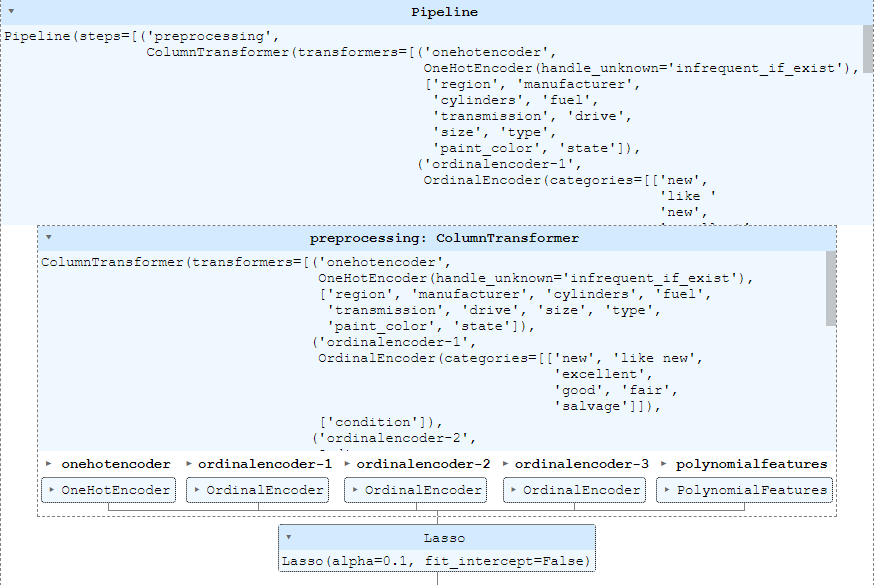

# Predcit a used car price

[detail notebook here](./practical_application_II_starter/prompt_II.ipynb)


## Goal

Understand what factors make a car more or less expesive
Provide clear recommendations to car dealship - as to what consumers value in a used car

## Business Ideas

### 1. Leverage Machin Learnig model to argument pricing for used cars

We have a machine leaerning model which can argument sales represnetitive pricing work. There is some margin which could be +/- 7050

### 2. Pricing is strongly correlated to 

#### 2.1. State

Buy cars from Delaware and sell in Vermont wil give us maximize sales revenue.
> For example, Ford White SUV good condition and clean titled car can be sold 35,597 in Vermont whereas the same car can be aquired 4,875 in MD.
> 
> The gap between the two state is 30,722.

#### 2.2. Car manufacturer and odometer

Factors that are affecting price of used car are that

- `manufacturer` - Ferrari, Tesla or Aston-martin such brand contribute price because retail price is expensive
- `odometer` - Very strong negative correlrated to the price of used car


## Exporatory Data Analysis

__Quality issues__

- Columns; manufacturer, condition, Cylinders, fuel, title_status, transmission, drive, size, type, paint_color, state are fine
- Issue with unclear model names
- Price range of car is beteen 0 and 3,736,928,711 (3B?)
    - Data quality need to be reviewed
    - 360,000 for Ferrari looks reasonable, but price for Toyota 3.7B isn't reasonable
    - 0 for a car isn't reasonable
- Around 4 % of data have missing value

__Insights__

- `id` and `VIN` are unique random number


- 42 different car brand (= manufacturer)


- Pricing factors
    - `title_status` - if the status is not `clean` then the price can be lower
        - For example, the 25 years old car with clean title more valuable than the 22 years old with salage titled car

    

    - `year` - postive correlation with price    
    - `odometer` - negative correlation with price

    

    - Price of similar cars are different in differnt `state`

    

    - `good condition` car better for our business than `excellent condition` car

    

<!--  -->

__Questions__

- What is currency of car price? Is it all USD or mix of USD and other
- Is this list price, traded in/out or sell in/out price?

## Feature Engineering

Categorical features


__Drop columns__

- `id, VIN, model` due to its uniquness and randomness thoes will be dropped during the trainng

__Select data set in range__

- Only the car price between 500.00 and 400,000.00 will be used for training


## Train model

    Experiment with three algorithms
    Also changed data set to avoid over/under fit
    Use the parameter, `Positive = True` to prevent negative price prediction
    - Linear Regression
    - Ridge
    - Lasso
    Used verious technique to find the best model and hyper parameter of it

Result of model trainings

|Model|Data set|Hyper Params|MSE|MAE|
|-|-|-|-|-|
|Linear Regression|Defaults|500 < car price < 120000|121928253.36|8198.16|
|Ridge|Defaults|500 < car price < 120000|114423615.06|7606.56|
|Lasso|Defaults|500 < car price < 120000|98000493.63|7008.86|
|Ridge|Grid Search CV|500 < car price < 120000|108301123.53|7435.62|
|Linear Regressopn|Defaults|500 < car price < 120000 without Sate, Region|126978774.65|8191.15|
|Ridge|Defaults|500 < car price < 120000 without Sate, Region|126978774.65|8191.15|
|Lasso|Defaults|500 < car price < 120000 without Sate, Region|56446418.64|5037.57|
|Lasso|Deafults|500 < car price < 120000 Ford in CA|172136863.09|9562.40|
|Lasso|Deafults|500 < car price < 120000 Ford only |135039985.93|8415.82|
|Lasso|Deafults|500 < car price < 100000 |84699147.65|7050.70|

### Hyperparameter tunning result

|Tune|Model|Data set|Hyper Params|MSE|MAE|
|-|-|-|-|-|-|
|Before|Lasso|Deafults|500 < car price < 100000 |84699147.65|7050.70|
|After|Lasso|alpha=0.1, fit_intercept=False|500 < car price < 100000 |51987298.13|4857.292936419671|

Model



Prediction result

__Summary__

    We have a model that can predict a car between 500 to 100000
    Note that it may not be able to provide estimate price for a luxary car such as Ferrari


### Feature importance

    regions are very important factors for pricing

Following shows how much regions are impoart (the higher number the more important)

```
region_detroit metro 0.002 +/- 0.000
region_delaware 0.002 +/- 0.000
region_houston 0.004 +/- 0.000
region_huntsville / decatur 0.004 +/- 0.000
region_anchorage / mat-su 0.026 +/- 0.001
region_albuquerque 0.035 +/- 0.001
region_eugene 0.045 +/- 0.001
region_humboldt county 0.061 +/- 0.001
region_kalispell 0.061 +/- 0.002
region_asheville 0.063 +/- 0.001
region_SF bay area 0.068 +/- 0.001
region_akron / canton 0.096 +/- 0.001
region_austin 0.106 +/- 0.001
region_charlotte 0.434 +/- 0.001
```